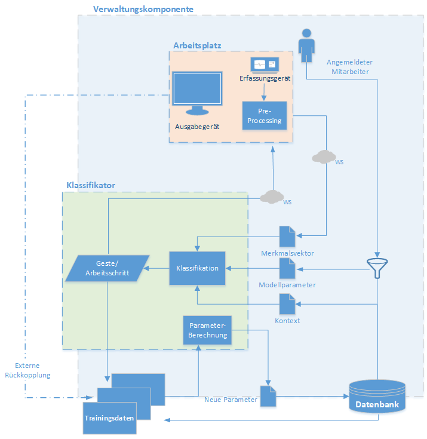

# NUI 4.0
### (aktueller Stand vom 02.11.2017)

## Client-Komponente
* Java-Application
* verbindet sich mit angeschlossener LeapMotion
* beinhaltet Preprocessing für die LM-Daten
* verbindet sich über WebSocket mit dem Server und sendet Merkmalsvektoren

## Server-Komponente
besteht aus der Verwaltungskomponente und dem Klassifikator:
### Verwaltungskomponente
* mit dem Play!-Framework aufgesetzter Server
* GUI über Browser zugänglich
* regelt Datenverkehr und Sessions
* kontrolliert den Klassifikator
* kontrolliert die Datenhaltung (DB)

### Klassifikator
* auf python-Script basierend
* mit der TensorFlow-Bibliothek umgesetztes RNN
* hat zwei Grundfunktionen: Trainieren und Klassifizieren

Schmatischer Aufbau:
